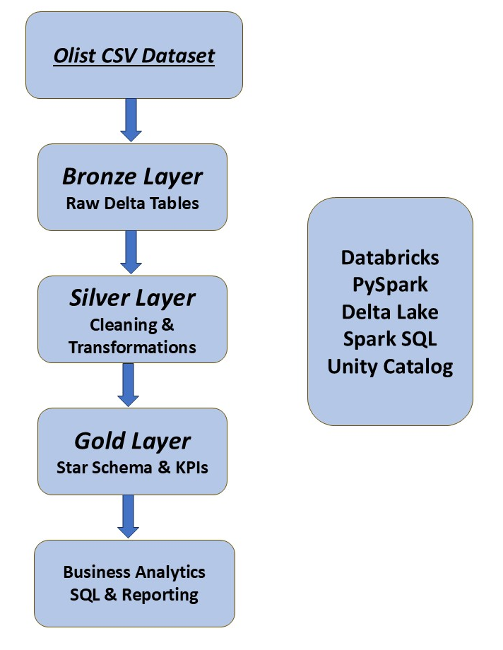

# Databricks Lakehouse Retail Project

## 📌 Project Overview

This project demonstrates the design and implementation of a modern data engineering pipeline using the Medallion Architecture (Bronze, Silver, Gold) on Databricks.

The project processes Brazilian e-commerce retail data from Olist and transforms raw data into analytics-ready business tables using PySpark, Delta Lake, and SQL.

---

# 🏗️ Architecture

The project follows the Medallion Architecture:

- Bronze Layer → Raw ingestion
- Silver Layer → Data cleaning and transformation
- Gold Layer → Business-ready analytics tables


---

# ⚙️ Technologies Used

- Databricks
- PySpark
- Delta Lake
- Spark SQL
- Unity Catalog
- Git & GitHub

---

# 📂 Dataset

Dataset used:
Brazilian E-Commerce Public Dataset by Olist

Source:
https://www.kaggle.com/datasets/olistbr/brazilian-ecommerce

---

# 🥉 Bronze Layer

Raw CSV files were ingested into Delta tables using Databricks Volumes.

Main tasks:
- Raw ingestion
- Schema handling
- Delta table creation

---

# 🥈 Silver Layer

Data transformation and cleaning layer.

Main tasks:
- Data cleaning
- Handling missing values
- Casting and standardization
- Deduplication
- Feature engineering

---

# 🥇 Gold Layer

Business-ready dimensional model.

Implemented:
- Fact tables
- Dimension tables
- Star schema
- KPIs and analytics queries

Gold tables:
- dim_customers
- dim_products
- dim_sellers
- dim_date
- fact_order_items

---

# 🔥 Advanced Features

Implemented advanced Delta Lake capabilities:

- Time Travel
- MERGE INTO
- SCD Type 2
- OPTIMIZE
- VACUUM

---

# 📊 Sample Business KPIs

- Revenue by category
- Monthly revenue trends
- Top seller states
- Payment analysis
- Delivery performance

---

# 📁 Project Structure

```text
databricks-streaming-project/
│
├── notebooks/
│   ├── bronze/
│   ├── silver/
│   └── gold/
│
├── datasets/
├── screenshots/
├── architecture/
│
├── README.md
└── requirements.txt
```
---

# 🚀 Future Improvements

Kafka streaming integration

Real-time ingestion

Databricks Workflows orchestration

Dashboard integration

---

# 👨‍💻 Author

## Noureddine RIDA

Driven by a strong passion for Data Engineering and modern Lakehouse architectures, I specialize in building scalable and reliable data pipelines using Databricks, PySpark, Delta Lake, Python, and SQL.

I have a solid background in Computer Systems, Software, and Data Engineering, with hands-on experience designing end-to-end ETL/ELT pipelines, transforming raw data into analytics-ready solutions, and implementing modern Medallion Architectures (Bronze, Silver, Gold).

My expertise includes:

* Databricks & Delta Lake
* PySpark & Spark SQL
* Data Modeling (Fact & Dimension Tables)
* ETL/ELT Pipelines
* Data Cleaning & Transformation
* Lakehouse Architecture
* Git & GitHub

I continuously improve my skills through real-world projects, Kaggle competitions, and professional certifications while focusing on scalable, high-performance, and production-ready data solutions.
